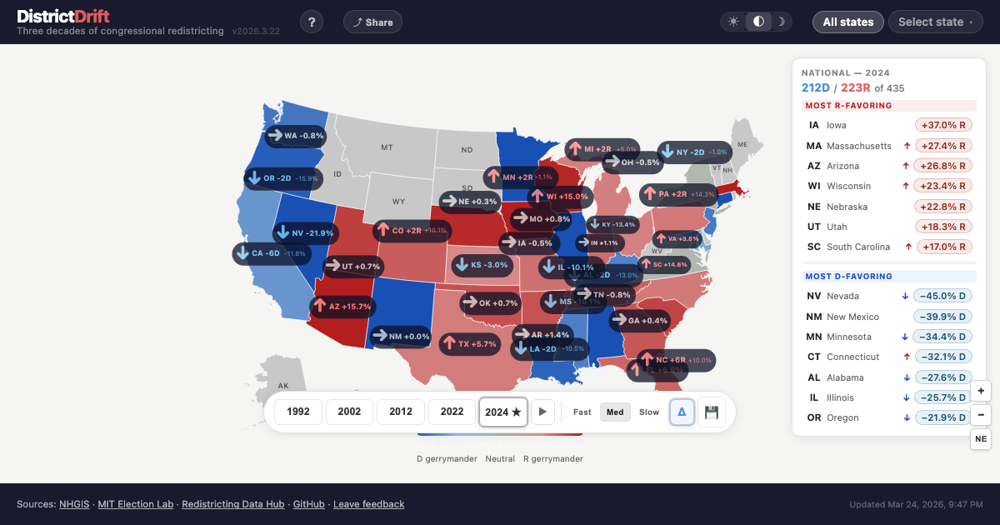
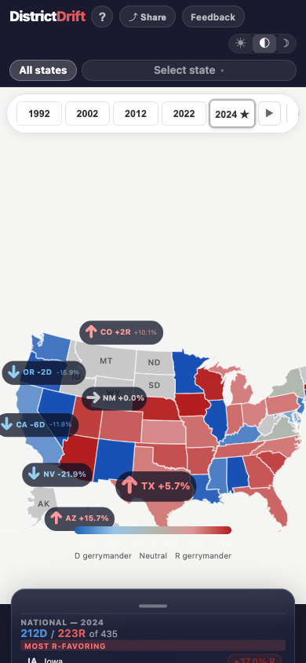

# District Drift

**Three decades of congressional gerrymandering — explore how redistricting shaped partisan outcomes in every US state from 1992 to 2024.**

🌐 **Live site: [districtdrift.org](https://districtdrift.org)**

---

<table>
<tr>
<td align="center"><strong>Desktop</strong></td>
<td align="center"><strong>Mobile</strong></td>
</tr>
<tr>
<td></td>
<td></td>
</tr>
</table>

---

## What it is

District Drift is a free, nonpartisan, public-interest website that documents the history of congressional redistricting in the United States across five cycles: 1992, 2002, 2012, 2022, and 2024.

It is **backward-looking** — a historical record for the general public, journalists, and educators showing how congressional maps have been drawn and who benefited. Both parties have gerrymandered; this site shows all of it.

Key features:
- **Nation view** — all 50 states ranked and colored by efficiency gap, with animated seat-change overlays across redistricting cycles
- **State view** — district-by-district maps with boundary morph animations between cycles
- **Partisan metrics** — efficiency gap, mean-median difference, seat/vote ratio, competitiveness
- **Demographics** — race, income, and education per district per cycle
- **Precinct layer** — raw precinct vote data for all 50 states (2012 and 2022 cycles)
- **Historical events** — key redistricting events and litigation for all 44 states with congressional districts
- **Mobile-optimised** — full touch support, pinch-zoom, bottom-sheet panels, and glassmorphism UI

## Stack

| Layer | Technology |
|-------|-----------|
| Frontend | SvelteKit (static output) |
| Maps | MapLibre GL JS + PMTiles |
| Charts | D3.js (direct SVG) |
| Pipeline | Python + GeoPandas + Tippecanoe |
| Hosting | Cloudflare Pages + Cloudflare R2 |

## Data sources

- [NHGIS](https://www.nhgis.org/) (U of Minnesota) — congressional district boundaries, 103rd–118th Congress; census demographics
- [MIT Election Lab](https://electionlab.mit.edu/) — US House election returns 1976–2024
- [Redistricting Data Hub](https://redistrictingdatahub.org/) — VEST precinct shapefiles
- [Princeton Gerrymandering Project](https://gerrymander.princeton.edu/) — historical partisan scores

## Running locally

See [CONTRIBUTING.md](CONTRIBUTING.md) for full setup instructions.

```bash
# Pipeline (Python)
cp .env.example .env   # add your free NHGIS API key
uv run python -m pipeline.download
uv run python -m pipeline.process
uv run python -m pipeline.tile

# Frontend
cd web && npm install && npm run dev
```

## License

[CC BY-NC-SA 4.0](LICENSE) — free to use and adapt with attribution, non-commercial only.
Copyright © 2026 Kana Nadarajan
